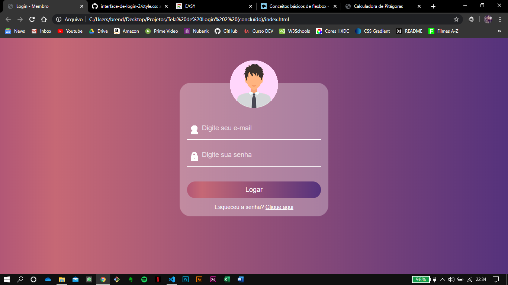

<!--# Interface de login / 2

### Tela de login com imagem de usuário, e-mail e senha.

Este é o meu quarto projeto desenvolvido com o objetivo de colocar em prática os conhecimentos obtidos durante o curso de Desenvolvimento Web. 

Esta é a segunda interface de login que eu desenvolvo, com a organização do código melhorada, mais bonita e com novas estilizações. 

Através dos repositórios está sendo possível acompanhar a minha evolução no aprendizado.

### ~ Para este projeto, eu aprendi como utilizar:
* Novas tags de formulário
* Estlização de Placeholder
* Gradientes
* Estilização de formulários e botões

## Screenshots do site:

-->
