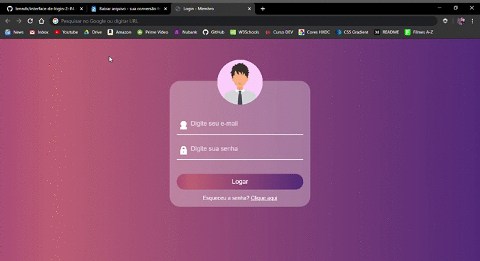

<h1 align="center">
  Faça seu login:
</h1>

### Este é o meu quarto projeto desenvolvido com o objetivo de colocar em prática os conhecimentos obtidos durante o aprendizado de Desenvolvimento Web. E através dos repositórios está sendo possível acompanhar uma timeline da minha evolução.
________
 
### 📚 Tecnologias utilizadas:
* CSS
* HTML

### ✨ Sobre o projeto e o que eu aprendi:
Esta é a segunda interface de login que eu desenvolvo, com a organização do código melhorada, mais bonita e com novas estilizações.

 *Para este projeto eu aprendi como utilizar novas tags de formulário, estilização de placeholder, gradientes, estilização de formulários e botões.*

### 📷 GIF do site:

________

<h4 align="center">
  Feito com ❤ by Brenda Miranda
</h4>
